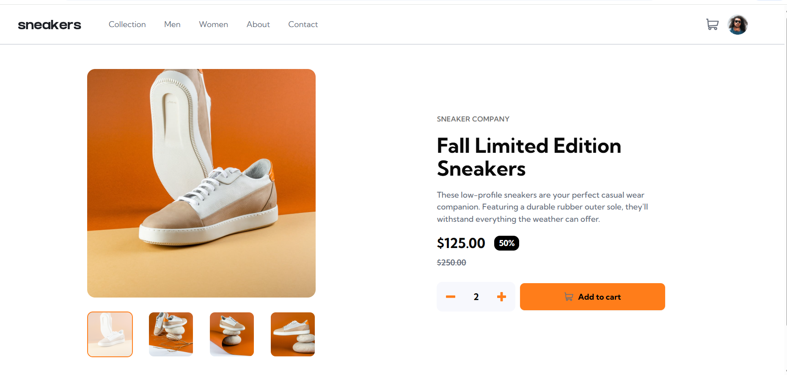

# Frontend Mentor - E-commerce product page solution

This is a solution to the [E-commerce product page challenge on Frontend Mentor](https://www.frontendmentor.io/challenges/ecommerce-product-page-UPsZ9MJp6). Frontend Mentor challenges help you improve your coding skills by building realistic projects.

## Table of contents

- [Overview](#overview)
  - [The challenge](#the-challenge)
  - [Screenshot](#screenshot)
  - [Links](#links)
- [My process](#my-process)
  - [Built with](#built-with)
  - [What I learned](#what-i-learned)
  - [Continued development](#continued-development)
  - [Useful resources](#useful-resources)
- [Author](#author)
- [Acknowledgments](#acknowledgments)


## Overview

### The challenge

The challenge was to build an **interactive e-commerce product page** where user can:

- View the optimal layout for the site depending on their device's screen size
- See hover states for all interactive elements on the page
- Open a lightbox gallery by clicking on the large product image
- Switch the large product image by clicking on the small thumbnail images
- Add items to the cart
- View the cart and remove items from it

This project helped me practice **state management**, **component communication** and **responsive UI design**

### Screenshot

 | 


### Links

- Solution URL: [Github Repo](https://github.com/Ruqayah1204/ecommerce-product-page)
- Live Site URL: [Ecommerce website url](https://your-live-site-url.com)

---

## My process

### Built with

- **React + TypeScript** - component-based UI with strong typing
- **Vite** - fast build tool and dev environment
- **Context API** - for managing cart state globally
- **Tailwind CSS** - for utility-first responsive styling
- **ShadCN UI** - for accessible, reusable UI components
- [React](https://reactjs.org/) - JS library


### What I learned

Working on this project taught me:
- How to lift state up and share it globally using Context API
- Handling **cart logic**: 
- The difference between **logic component state** and **global app state**
- How to create a product lightbox with the help of shaCN carousel api documentation


To see how you can add code snippets, see below:

```tsx
 //example of the add to cart state logic

 const addToCart = (product: cartDetail) =>{
    setCart(prev => {
        const existingProduct = prev.find(item => item.id === product.id)

        if(existingProduct){
            return prev.map(item =>
                item.id === product.id? {...item, quantity: product.quantity} : item
            );
        }
        return [...prev, product]
    });
 }
```


### Continued development

In the future, I want to:

+ Add authentication so users can log in and save their cart.
- Improve accessibilit with full keyboard navigation and ARIA roles
- Implement the checkout page and logic with payment integration.


### Useful resources

- [React Docs- Context API](https://react.dev/reference/react/useContext) - This helped me understand global state.
- [Tailwind CSS Documentation](https://tailwindcss.com/docs) - This is great for quick and responsive styling.
- [ShadCN UI](https://ui.shadcn.com/) - This is great for prebuilt accessible UI component that sped up development.


## Author

- Github - [Salaudeen Rukayat](https://github.com/Ruqayah1204)
- Twitter/X - [@RuqayahThe](https://x.com/RuqayahThe)
- LinkedIn - [@Salaudeen Rukayat](https://www.linkedin.com/in/salaudeenrukayat)


## Acknowledgments

